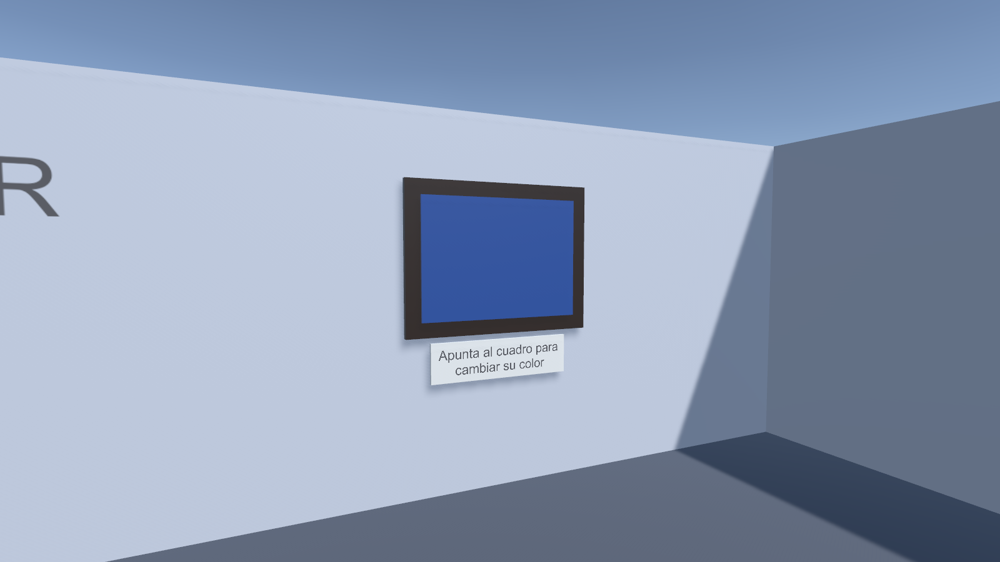

# Taller de mantenimiento XR

**Estudiante:** Ttito, Max
**Código:** PENDIENTE
**Curso:** Laboratorio de Realidad Extendida (XR) para Videojuegos
**Docente:** Victor Alejandro Arroyo Castro

## Descripción

Proyecto del XR Interaction Challenge hecho en Unity 6.6 con URP y XR Interaction Toolkit. La escena es un taller de
12 x 12 m cerrado por cuatro muros. Sobre una mesa de metal hay herramientas que se pueden agarrar y lanzar, una lámpara
de trabajo que se prende con un botón, un cuadro en la pared que cambia de color con el rayo y una caja roja donde hay que
guardar las herramientas.

La escena es `Assets/Scenes/EC_XR_TtitoMax.unity`.

## Funcionalidades

- **Objetos manipulables:** martillo, llave inglesa, destornillador y linterna, armados con primitivas. Cada uno tiene
  `Rigidbody` y `XR Grab Interactable`, se lanza al soltarlo y vuelve a la mesa si cae fuera de la sala.
- **Interacción a distancia:** el botón amarillo del pedestal prende y apaga la lámpara de trabajo, y el cuadro de la
  pared cambia de color. Los dos usan `XR Simple Interactable` y se activan apuntando con el rayo.
- **Reto libre:** la caja de herramientas cuenta cuántas herramientas tiene guardadas y muestra "¡Taller ordenado!" cuando
  están las cuatro. Además el piso sirve para teletransportarse, hay una plataforma de teleport en una esquina y el botón
  rojo devuelve todo a la mesa.

## Controles

Con visor Meta Quest (OpenXR): grip para agarrar o pulsar lo que apunta el rayo, y la palanca hacia adelante para el
teleport.

Sin visor, en el editor aparece el XR Interaction Simulator:

| Tecla | Acción |
| --- | --- |
| W A S D | Moverse |
| Q / E | Bajar / subir |
| Clic derecho + mouse | Mirar alrededor |
| Tab | Alternar entre mover la cabeza y mover las manos |
| `[` / `]` | Elegir qué mano se mueve con el mouse (izquierda, derecha o las dos) |
| G / T | Grip y gatillo de la mano derecha |
| Shift + G / T | Grip y gatillo de la mano izquierda |
| I | Palanca hacia adelante (teleport) |
| R | Reiniciar la posición del simulador |

Las dos manos funcionan igual: cualquiera puede agarrar, pulsar botones y teletransportarse.

## Capturas

Vista general del taller:

Componentes del martillo en el Inspector (`Rigidbody` y `XR Grab Interactable`):

Interacción en Play: martillo en la mano derecha, cuadro cambiado de color y dos herramientas ya guardadas en la caja:

Mesa de metal con las herramientas y la lámpara de trabajo:

Cuadro que cambia de color:

## Video

PENDIENTE

## Tecnologías

- Unity 6.6 (6000.6.0f1) con Universal Render Pipeline 17.6
- XR Interaction Toolkit 3.6 (Starter Assets y XR Interaction Simulator)
- XR Plug-in Management 4.7 y OpenXR 1.18, con Meta Quest y el perfil Oculus Touch en Android
- Input System 1.20
