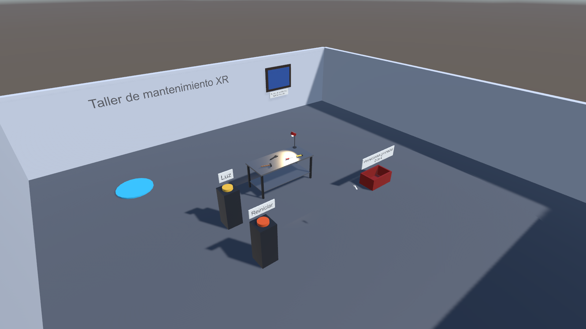
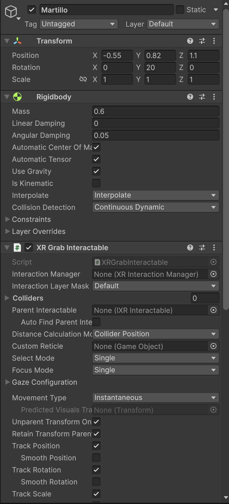
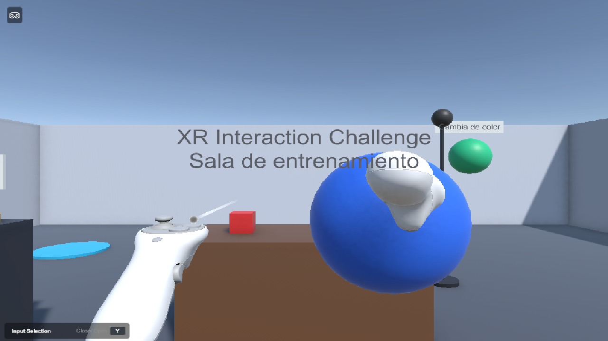
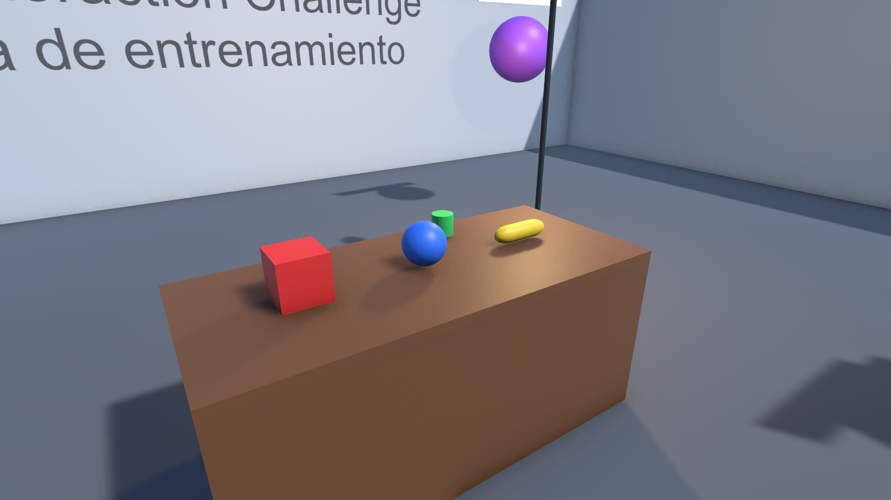

# XR Interaction Challenge

**Estudiante:** Ttito, Max
**Código:** PENDIENTE
**Curso:** Laboratorio de Realidad Extendida (XR) para Videojuegos
**Docente:** Victor Alejandro Arroyo Castro

## Descripción

Sala de entrenamiento XR hecha en Unity 6.6 con URP y XR Interaction Toolkit. Es un cuarto de 12 x 12 m cerrado por cuatro
muros, con una mesa de objetos para agarrar y lanzar, un botón que prende y apaga una lámpara, un orbe que cambia de color
con el rayo y una canasta que cuenta cuántos objetos caen dentro.

La escena es `Assets/Scenes/EC_XR_TtitoMax.unity`.

## Funcionalidades

- **Objetos manipulables:** cubo, esfera, herramienta y llave. Cada uno tiene `Rigidbody` y `XR Grab Interactable`, se
  pueden lanzar al soltarlos y si se caen fuera de la sala vuelven a la mesa.
- **Interacción a distancia:** el botón amarillo del pedestal enciende y apaga la lámpara, y el orbe morado cambia de
  color. Los dos usan `XR Simple Interactable` y se activan apuntando con el rayo.
- **Reto libre:** la canasta azul lleva la cuenta de los objetos que tiene dentro y el récord. Además el piso sirve para
  teletransportarse, hay una plataforma de teleport en una esquina y el botón rojo devuelve todo a la mesa.

## Controles

Con visor Meta Quest (OpenXR): grip para agarrar o pulsar lo que apunta el rayo, y la palanca hacia adelante para el
teleport.

Sin visor, en el editor aparece el XR Interaction Simulator:

| Tecla | Acción |
| --- | --- |
| W A S D | Moverse |
| Q / E | Bajar / subir |
| Clic derecho + mouse | Mirar alrededor |
| Tab | Alternar entre mover la cabeza y mover las manos |
| `[` / `]` | Elegir qué mano se mueve con el mouse (izquierda, derecha o las dos) |
| G / T | Grip y gatillo de la mano derecha |
| Shift + G / T | Grip y gatillo de la mano izquierda |
| I | Palanca hacia adelante (teleport) |
| R | Reiniciar la posición del simulador |

Las dos manos funcionan igual: cualquiera puede agarrar, pulsar botones y teletransportarse.

## Capturas

Vista general del escenario:

Componentes en el Inspector:

Interacción en Play: esfera agarrada, lámpara apagada con el botón y orbe cambiado de color:

Mesa con los objetos:

## Video

PENDIENTE

## Tecnologías

- Unity 6.6 (6000.6.0f1) con Universal Render Pipeline 17.6
- XR Interaction Toolkit 3.6 (Starter Assets y XR Interaction Simulator)
- XR Plug-in Management 4.7 y OpenXR 1.18, con Meta Quest y el perfil Oculus Touch en Android
- Input System 1.20
